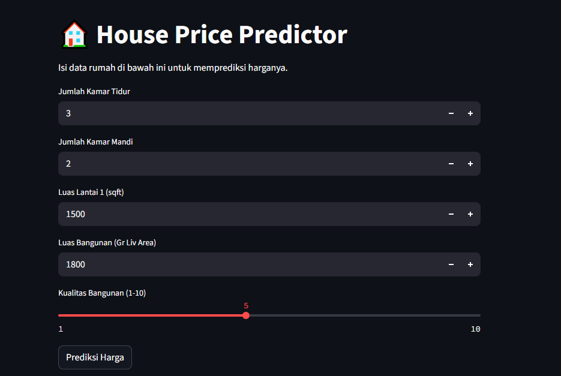

## 🏡 House Price Predictor

 <!-- Kalau ada gambar banner project -->

### 📌 Deskripsi

House Price Predictor adalah sebuah aplikasi berbasis AI yang memprediksi harga rumah berdasarkan beberapa fitur seperti luas tanah, jumlah kamar tidur, jumlah kamar mandi, dan fitur properti lainnya. Model ini dibuat menggunakan **Scikit-learn** dan di-deploy menggunakan **Streamlit**.

### 📊 Fitur Aplikasi

* Prediksi harga rumah berdasarkan input user
* Visualisasi data sederhana
* API berbasis Streamlit yang mudah diakses

---

### 🛠️ Teknologi yang Digunakan

* Python 3.x
* Pandas
* Scikit-learn
* Streamlit
* Joblib

---

### 📦 Instalasi & Cara Menjalankan

#### 📌 Clone repository:

```bash
git clone https://github.com/nistayle/house_price_predictor_streamlit.git
cd house_price_predictor
```

#### 📌 Install dependencies:

```bash
pip install -r requirements.txt
```

#### 📌 Jalankan aplikasi:

```bash
streamlit run app.py
```

---

### 📁 Struktur Project

```
house_price_predictor/
├── app.py                  # Streamlit app
├── model.pkl               # Model hasil training
├── requirements.txt        # Dependency project
├── README.md               # Dokumentasi project
├── .gitignore              # File ignore Git
└── gambar.png              # (opsional) Gambar banner
```
